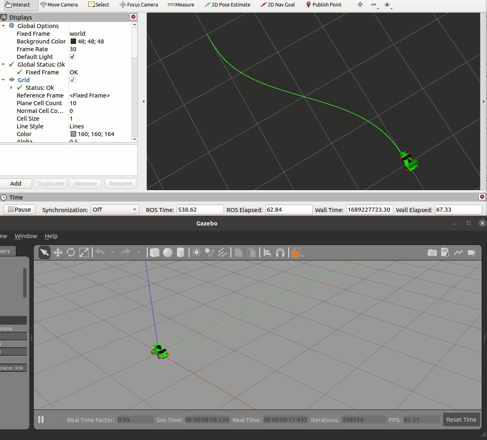

# Autonomous vehicle decision and control simulation in ROS1

R2_simulation

## Algorithm

Longtitude : Double PID  
Lateral: Stanley  
CarURDF: [Yahboom](https://www.yahboom.com/study/ROSMASTER-R2)

## Experiment

Tracking quintic polynomial.

## Result

